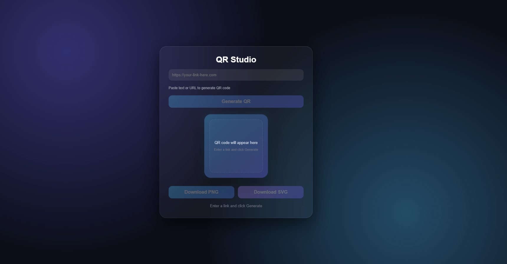
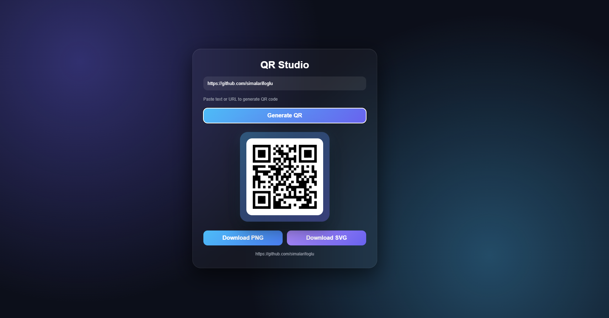

# QR Studio

Modern ve minimalist QR Code Generator uygulaması.  
React + Vite kullanılarak geliştirilmiştir.

---

## Proje Hakkında

QR Studio, kullanıcıların metin veya URL girerek hızlı şekilde QR kod oluşturmasını sağlar.  
Oluşturulan QR kodlar **PNG** veya **SVG** formatında indirilebilir.

---

## Özellikler

- Text / URL ile QR oluşturma
- Buton ile QR üretimi
- PNG olarak indirme
- SVG olarak indirme
- Responsive tasarım

---

## Ekran Görüntüleri

### Ana Ekran (Boş State)


### QR Oluşturulmuş Hali


---

## Kullanılan Teknolojiler

- React
- Vite
- react-qr-code
- html-to-image
- CSS3 (Glassmorphism UI)

---

## Kurulum

Projeyi localde çalıştırmak için:

```bash
git clone https://github.com/simalarifoglu/QR-Code-Generator.git
cd QR-Code-Generator
npm install
npm run dev
```

---

## License

Bu proje MIT Lisansı altında lisanslanmıştır. 
Detaylar için `LICENSE` dosyasını inceleyebilirsiniz.